# Komponente KYC

- `groupId` is the identifier of the group at the origin of the project.
- `artifactId` is the identifier of the project within that group.
- A JDBC driver is a Java class that allows your Java application to connect to a database.

---

##  Kerkesa 1: Listo nga tabela student

**Shpjegim:**  
Ky kod perdor nje `Statement` per te marr informacion nga tabela `student`dhe per te shfaqur emrin dhe emailin e studenteve. Ky proces merr te gjitha te dhenat nga tabela.

**Rezultati:**  
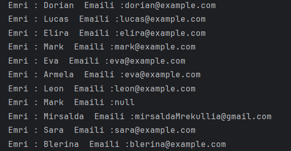

---

##  Kerkesa 2: Listo Tabelat

**Shpjegim:**  
Esht`e perdorur `DatabaseMetaData` per te marre te gjitha te dhenat mbi databazen. Funksioni `getTables` kthen nje liste te tabelave ne databaze, te cilat iterohen dhe shfaqen.

**Rezultati:**  

---

##  Kerkesa 3: Beni query stud me me shume se 10 pike

**Shpjegim:**  
Ky kod perdor nje query te ngjashem me kerkesen e pare, por eshte shtuar nje kusht qe selekton vetem studentet me pike me te medha se 10.

**Rezultati:**  
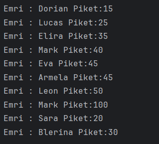

---

##  Kerkesa 4: Shtoni nje student

**Shpjegim:**  
Gjate ekzekutimit, eshte vene re se insertimi behet 3 here pavaresisht nese user-i ekziston. Mund te shtohet nje kusht per te kontrolluar nese emri ekziston ne databaze dhe ne kete rast te mos ekzekutohet insertimi.

**Rezultati:**  
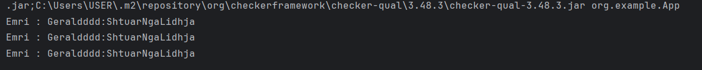

---

##  Kerkesa 5: Modifikoni piket e nje studenti

**Shpjegim:**  
Ky kod perdor te njejten logjike si kerkesa e pare, por ka nje shtese per te printuar pike para dhe pas update-it. Modifikohen pikat e nje studenti me emrin "Mirsalda".

**Rezultati:**  
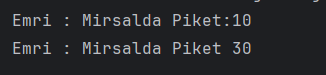

---

## Kerkesa: Fshini nje student

**Shpjegim:**  
Ne kete shembull perdoret `PreparedStatement` i cili ruan nga SQL Injection.

**Rezultati:**  
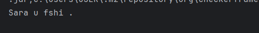

**Pas fshirjes:**  
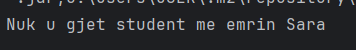

##  Ushtrimet me Connection

## Sapo pashe qe per kalim te dhenash si parameter te perdorim klase Student me get , mendova se duhet te krijojme metodat ne nje klase Student :)
**Shpjegim:**  
Me shume shpjegime mbi keto rezultate kam vendosur komentet ne metoda si dhe thirrjet e funskioneve ne main 

**Lidhja me databazen :**  

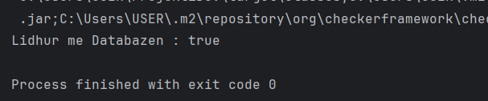

**Krijimi i tabeles:**  

**Fshirja e tabeles :**  

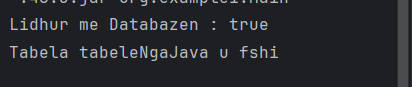

**Shtimi i studentit**  

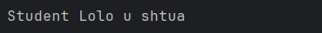

**Modifikimi i studentit :**  

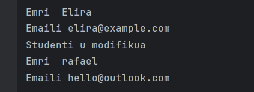

**Fshirja e studentit:**  

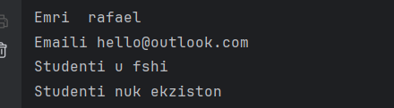