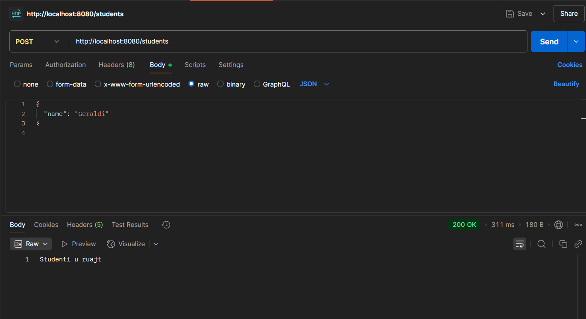
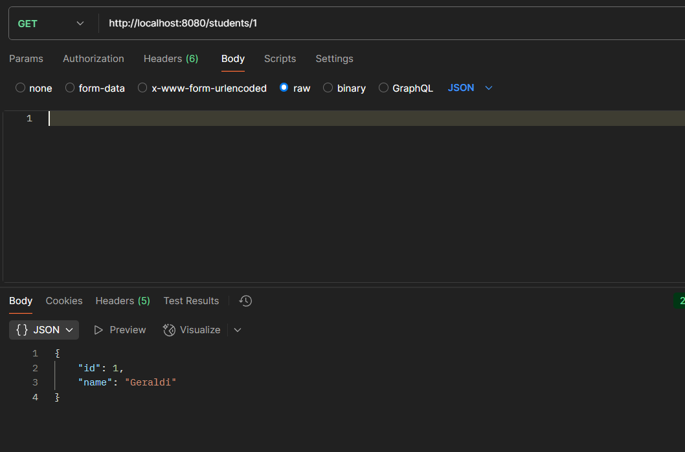
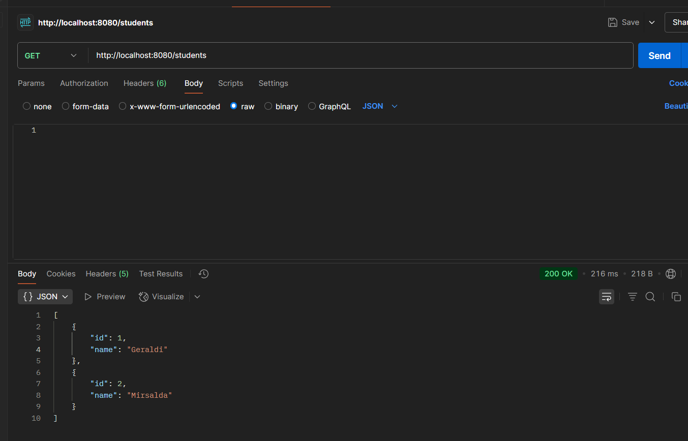
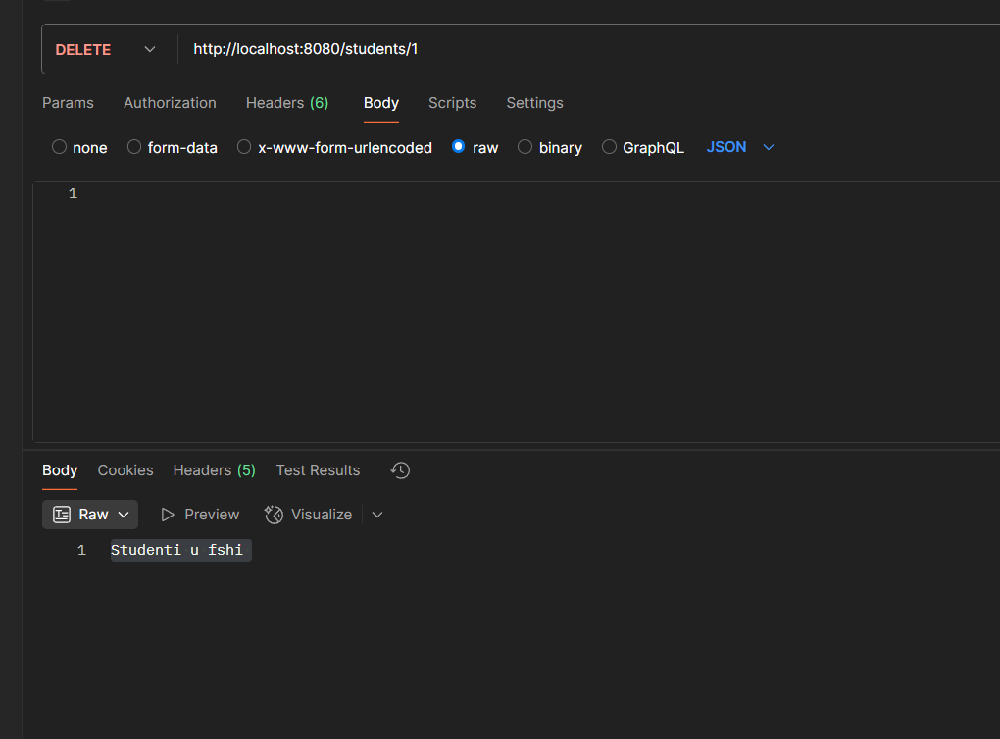

#  Projekt i thjeshte me gjerat qe kemi mesuar  me Spring Boot

Fillimisht kam bere kerkesat me get post mbi mesazhet , ne klasen controller .

Krijova nje **app te thjeshte me veprime CRUD**, duke perdorur metodat `GET` dhe `POST` qe kemi mesuar, disa nga **anotacionet**, si dhe entitetin per krijimin e tabeles dhe `application.properties` per ta lidhur me databazen.

Sic beme ne fillim me `URL`, `user`, `password` dhe `DriverManager`, e njejta logjike eshte ndjekur.

---

##  Struktura e Projektit

Kam ndjekur menyren klasike te zhvillimit sipas radhes:

1. `Java Class` (Modeli)
2. `Repository`
3. `Service`
4. `Controller`

---

##  Përdorimi i Komponenteve

- **Ne Service** kam perdorur metodat e gatshme te `JpaRepository`, duke shtuar nje printim ne console.
- **Ne Controller** kam perdorur `GET` dhe `POST` te thjeshta, si dhe `@PathVariable` dhe `@RequestBody`.

---

##  Testimi me Postman

###  Ruajtja ne databaze me POST
Per te ruajtur nje student, mjafton te dergosh vetem `name`. `id` gjenerohet automatikisht.

  

---

###  Marrja e nje studenti sipas ID
Duke kaluar ID ne URL, perdoret `@PathVariable` per ta lexuar.

---

###  Marrja e te gjithe studenteve
Nese therras `GET /students`, merret lista e plote. Kjo eshte metoda default.

---

### Fshirja e nje studenti
Fshihet nje student sipas ID duke perdorur `DELETE`.

